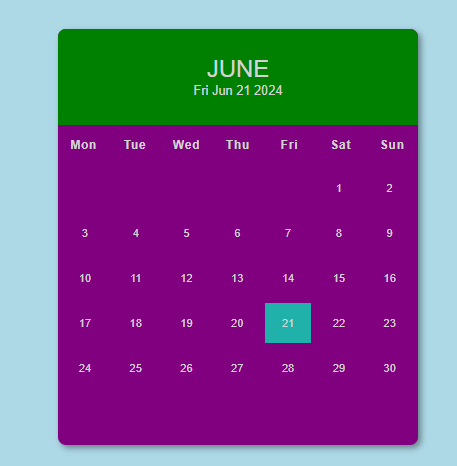

# month-calendar

## Description
The Month Calendar Web App is a simple and intuitive application designed to display a monthly calendar. Built with HTML, CSS and JavaScript. The calendar includes a header displaying the current month and date, all dates of the month from 1 to 30, and accurately reflects today's date. Everything is dynamically generated and automatically updates based on the current date and month. The calendar is visually appealing with effects like shadow and other design elements styled with CSS.

## Prerequisites
N/A

## Features
* Display current month's calendar.
* Responsive design for mobile and desktop use.
* Highlight current date.

## Technologies Used
Built with:
* HTML
* CSS
* JavaScript

## Installation
N/A

## Usage
* Open the Month Calendar web application in your browser.
* View the current month's calendar.

## Project Link
Application can can be viewed here: 
* [Live](https://yvonnesarah.github.io/month-calendar/)

* [Repository](https://github.com/yvonnesarah/month-calendar)

## Screenshot
Month Calendar

## Credit
N/A

## Licence
Please refer to the LICENSE in the repo.